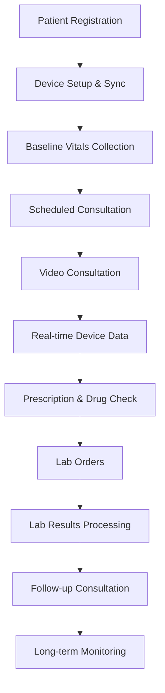

# Healthcare Platform - Integration Testing Scenarios

## 🎯 **Integration Testing Strategy**

This document outlines specific integration testing scenarios for the Healthcare Management Platform, focusing on **cross-phase interactions** and **complete healthcare workflows**.

---

## 🔬 **PHASE 1 ↔ PHASE 4 INTEGRATION**

### **Scenario 1: Drug Safety During Video Consultations**
**Priority: 🔴 Critical | Patient Safety**

#### **Test Flow:**
1. **Doctor starts video consultation with patient**
2. **Doctor prescribes medication during session**
3. **System checks for drug interactions with patient's current medications**
4. **System checks patient allergies**
5. **Alert displayed if interactions/allergies found**
6. **Doctor can override with justification or select alternative**

#### **Test Cases:**
```typescript
const drugSafetyTests = [
  {
    scenario: "Major drug interaction during consultation",
    patientMedications: ["warfarin", "metformin"],
    prescribedMedication: "aspirin",
    expectedAlert: "MAJOR: Bleeding risk with warfarin + aspirin",
    expectedAction: "Block prescription, suggest alternatives"
  },
  {
    scenario: "Patient allergy alert during consultation",
    patientAllergies: ["penicillin"],
    prescribedMedication: "amoxicillin",
    expectedAlert: "ALLERGY: Patient allergic to penicillin family",
    expectedAction: "Block prescription, suggest non-penicillin antibiotic"
  },
  {
    scenario: "Safe prescription during consultation",
    patientMedications: ["lisinopril"],
    prescribedMedication: "metformin",
    expectedAlert: null,
    expectedAction: "Allow prescription"
  }
];
```

#### **API Sequence:**
```typescript
// 1. Start consultation
POST /api/video-consultations
// 2. Check drug interactions
POST /api/drug-interactions/check
// 3. Check patient allergies  
GET /api/patient-allergies/{patientId}
// 4. Create prescription (if safe)
POST /api/medications
```

### **Scenario 2: Lab Order Safety Integration**
**Priority: 🟡 Medium | Clinical Safety**

#### **Test Flow:**
1. **Doctor orders lab tests during or after consultation**
2. **System checks if patient medications affect lab results**
3. **System warns about medication interactions with lab tests**
4. **Fasting requirements checked against patient medications**
5. **Special instructions generated based on patient profile**

#### **Test Cases:**
```typescript
const labSafetyTests = [
  {
    scenario: "Medication affecting lab results",
    patientMedications: ["simvastatin"],
    orderedTests: ["CMP"], // Liver function tests
    expectedWarning: "Simvastatin may affect liver enzymes",
    expectedAction: "Note in lab order, consider timing"
  },
  {
    scenario: "Fasting requirements with diabetes medication",
    patientMedications: ["metformin"],
    orderedTests: ["LIPID", "CMP"],
    expectedWarning: "Patient on diabetes medication - fasting protocol",
    expectedAction: "Provide diabetes-specific fasting instructions"
  }
];
```

---

## 📱 **PHASE 3 ↔ PHASE 4 INTEGRATION**

### **Scenario 3: Real-time Device Monitoring During Consultations**
**Priority: 🟡 Medium | Enhanced Care**

#### **Test Flow:**
1. **Patient connects to video consultation**
2. **Patient's connected devices (BP monitor, glucose meter) active**
3. **Real-time vital signs displayed in consultation interface**
4. **Doctor can request live readings during consultation**
5. **Abnormal readings trigger immediate alerts**
6. **Consultation notes include device data**

#### **Test Cases:**
```typescript
const deviceConsultationTests = [
  {
    scenario: "Blood pressure monitoring during consultation",
    connectedDevices: ["BP_MONITOR_001"],
    consultationActive: true,
    liveReading: { systolic: 180, diastolic: 95 },
    expectedAlert: "HIGH BP ALERT: 180/95 during consultation",
    expectedAction: "Display alert to doctor, suggest immediate action"
  },
  {
    scenario: "Glucose monitoring during diabetes consultation",
    connectedDevices: ["GLUCOSE_METER_001"],
    consultationActive: true,
    liveReading: { glucose: 45 },
    expectedAlert: "CRITICAL LOW GLUCOSE: 45 mg/dL",
    expectedAction: "Emergency protocol, end consultation if needed"
  }
];
```

### **Scenario 4: IoT-Triggered Emergency Consultations**
**Priority: 🔴 Critical | Emergency Response**

#### **Test Flow:**
1. **IoT device detects critical reading**
2. **Emergency alert generated**
3. **System automatically checks doctor availability**
4. **Emergency consultation session created**
5. **Patient and doctor notified immediately**
6. **Emergency consultation initiated with device context**

#### **Test Cases:**
```typescript
const emergencyConsultationTests = [
  {
    scenario: "Critical heart rate triggers emergency consultation",
    deviceReading: { heartRate: 180, timestamp: "2025-01-15T10:30:00Z" },
    expectedAlert: "CRITICAL: Heart rate 180 BPM",
    expectedAction: "Auto-create emergency consultation",
    responseTime: "< 2 minutes",
    doctorNotification: "SMS + Push + Call"
  },
  {
    scenario: "Severe hypoglycemia emergency",
    deviceReading: { glucose: 35, timestamp: "2025-01-15T14:45:00Z" },
    expectedAlert: "SEVERE HYPOGLYCEMIA: 35 mg/dL",
    expectedAction: "Emergency consultation + 911 alert option",
    responseTime: "< 1 minute",
    emergencyProtocol: "Active"
  }
];
```

---

## 🩺 **COMPLETE HEALTHCARE WORKFLOW INTEGRATION**

### **Scenario 5: Comprehensive Patient Care Journey**
**Priority: 🔴 Critical | End-to-End Workflow**

#### **Complete Patient Journey:**


#### **Test Execution:**
```typescript
describe('Complete Healthcare Workflow', () => {
  test('End-to-end patient journey', async () => {
    // 1. Patient Registration
    const patient = await createTestPatient({
      allergies: ['penicillin'],
      currentMedications: ['metformin', 'lisinopril']
    });

    // 2. Device Registration  
    const devices = await registerDevices(patient.id, [
      'BloodPressureMonitor',
      'GlucoseMeter'
    ]);

    // 3. Baseline Vitals
    await recordVitals(patient.id, {
      bloodPressure: { systolic: 130, diastolic: 85 },
      glucose: 95
    });

    // 4. Schedule Consultation
    const consultation = await bookConsultation({
      doctorId: 'test-doctor-1',
      patientId: patient.id,
      type: 'routine_followup'
    });

    // 5. Conduct Video Consultation
    const session = await startVideoConsultation(consultation.id);
    
    // 6. Live Device Data During Consultation
    const liveVitals = await getDeviceReadings(patient.id);
    expect(session.deviceData).toEqual(liveVitals);

    // 7. Prescription with Safety Checks
    const prescription = await prescribeMedication({
      patientId: patient.id,
      medication: 'amlodipine',
      consultationId: session.id
    });
    expect(prescription.safetyChecks.passed).toBe(true);

    // 8. Lab Orders
    const labOrder = await createLabOrder({
      patientId: patient.id,
      tests: ['CBC', 'CMP', 'HBA1C'],
      priority: 'routine'
    });

    // 9. Process Lab Results
    const results = await processLabResults(labOrder.id, {
      CBC: { status: 'normal' },
      CMP: { status: 'abnormal', flag: 'high_glucose' },
      HBA1C: { value: 8.5, status: 'critical' }
    });

    // 10. Critical Result Alert
    expect(results.alerts.length).toBeGreaterThan(0);
    expect(results.alerts[0].severity).toBe('critical');

    // 11. Follow-up Consultation Triggered
    const followUp = await getTriggeredConsultations(patient.id);
    expect(followUp.length).toBe(1);
    expect(followUp[0].reason).toBe('critical_lab_results');
  });
});
```

### **Scenario 6: Emergency Response Integration**
**Priority: 🔴 Critical | Life Safety**

#### **Emergency Cascade:**
1. **IoT device detects critical reading**
2. **Phase 3: Emergency alert generated**
3. **Phase 1: Drug interaction check for emergency medications**
4. **Phase 4: Emergency consultation initiated**
5. **Phase 4: STAT lab orders if needed**
6. **Complete emergency documentation**

#### **Test Implementation:**
```typescript
describe('Emergency Response Integration', () => {
  test('Critical device reading emergency cascade', async () => {
    const startTime = Date.now();

    // 1. Critical Device Reading
    const criticalReading = await simulateDeviceReading({
      deviceId: 'CARDIAC_MONITOR_001',
      patientId: 'emergency-patient-1',
      reading: { heartRate: 200, rhythm: 'irregular' },
      severity: 'critical'
    });

    // 2. Verify Emergency Alert Generated (< 30 seconds)
    const alerts = await waitForEmergencyAlerts('emergency-patient-1');
    expect(Date.now() - startTime).toBeLessThan(30000);
    expect(alerts[0].severity).toBe('critical');

    // 3. Auto-initiate Emergency Consultation
    const emergencyConsultation = await getEmergencyConsultation(
      'emergency-patient-1'
    );
    expect(emergencyConsultation.priority).toBe('emergency');
    expect(emergencyConsultation.status).toBe('auto_initiated');

    // 4. Doctor Joins with Full Context
    const doctorSession = await doctorJoinEmergency(
      emergencyConsultation.id,
      'emergency-doctor-1'
    );
    expect(doctorSession.context.deviceReading).toEqual(criticalReading);
    expect(doctorSession.context.patientHistory).toBeDefined();

    // 5. Emergency Medication Safety Check
    const emergencyMeds = await checkEmergencyMedications({
      patientId: 'emergency-patient-1',
      proposedMedications: ['epinephrine', 'amiodarone']
    });
    expect(emergencyMeds.safetyCheck.completed).toBe(true);

    // 6. STAT Lab Orders
    const statLabOrder = await createStatLabOrder({
      patientId: 'emergency-patient-1',
      tests: ['TROPONIN', 'BNP', 'CBC'],
      priority: 'stat'
    });
    expect(statLabOrder.priority).toBe('stat');
    expect(statLabOrder.expectedTAT).toBeLessThan(60); // 60 minutes

    // 7. Complete Response Time Check
    const totalResponseTime = Date.now() - startTime;
    expect(totalResponseTime).toBeLessThan(120000); // 2 minutes max
  });
});
```

---

## 🔄 **CROSS-PLATFORM DATA SYNCHRONIZATION**

### **Scenario 7: Multi-Source Health Data Integration**
**Priority: 🟡 Medium | Data Integrity**

#### **Data Sources:**
- **Phase 1**: Drug interactions, allergies, safety alerts
- **Phase 3**: IoT device readings, trends, alerts
- **Phase 4**: Consultation notes, lab results, prescriptions

#### **Test Cases:**
```typescript
const dataSyncTests = [
  {
    scenario: "Patient health dashboard data synchronization",
    dataSources: {
      medications: "Phase 1 database",
      deviceReadings: "Phase 3 IoT stream", 
      consultations: "Phase 4 video platform",
      labResults: "Phase 4 lab integration"
    },
    expectedSync: "< 5 seconds",
    dataIntegrity: "100% consistency",
    expectedDashboard: {
      currentMedications: "accurate",
      recentVitals: "real-time",
      upcomingAppointments: "current",
      pendingLabResults: "updated"
    }
  }
];
```

### **Scenario 8: Healthcare Provider Workflow Integration**
**Priority: 🟡 Medium | Provider Experience**

#### **Doctor Dashboard Integration:**
```typescript
describe('Healthcare Provider Workflow', () => {
  test('Doctor dashboard integration across all phases', async () => {
    const doctorId = 'test-doctor-1';
    
    // Get integrated dashboard data
    const dashboard = await getDoctorDashboard(doctorId);
    
    // Verify Phase 1 data (Safety alerts)
    expect(dashboard.safetyAlerts).toBeDefined();
    expect(dashboard.criticalInteractions.length).toBeGreaterThanOrEqual(0);
    
    // Verify Phase 3 data (Patient device status)
    expect(dashboard.patientDeviceStatus).toBeDefined();
    expect(dashboard.criticalDeviceAlerts.length).toBeGreaterThanOrEqual(0);
    
    // Verify Phase 4 data (Consultations and lab results)
    expect(dashboard.upcomingConsultations).toBeDefined();
    expect(dashboard.pendingLabResults).toBeDefined();
    expect(dashboard.criticalLabResults.length).toBeGreaterThanOrEqual(0);
    
    // Test cross-phase correlation
    const patientSummary = await getPatientSummary(
      dashboard.upcomingConsultations[0].patientId
    );
    expect(patientSummary.medications).toBeDefined(); // Phase 1
    expect(patientSummary.deviceData).toBeDefined(); // Phase 3
    expect(patientSummary.consultationHistory).toBeDefined(); // Phase 4
  });
});
```

---

## 🛡️ **SECURITY INTEGRATION TESTING**

### **Scenario 9: Cross-Phase Security Validation**
**Priority: 🔴 Critical | Security**

#### **Security Test Cases:**
```typescript
const securityTests = [
  {
    scenario: "Role-based access across all phases",
    userRole: "PATIENT",
    allowedEndpoints: [
      "/api/video-consultations (own only)",
      "/api/lab/orders (own results only)",
      "/api/connected-devices (own devices only)"
    ],
    blockedEndpoints: [
      "/api/drug-interactions/admin",
      "/api/emergency-alerts (other patients)",
      "/api/lab/orders (create - doctor only)"
    ]
  },
  {
    scenario: "Healthcare data encryption in transit",
    testEndpoints: [
      "/api/video-consultations",
      "/api/lab/orders",
      "/api/connected-devices"
    ],
    expectedEncryption: "TLS 1.3",
    hipaaCompliance: true
  }
];
```

### **Scenario 10: Audit Log Integration**
**Priority: 🔴 Critical | Compliance**

#### **Audit Trail Testing:**
```typescript
describe('Healthcare Audit Integration', () => {
  test('Complete audit trail across all phases', async () => {
    const patientId = 'audit-test-patient';
    const doctorId = 'audit-test-doctor';
    
    // Phase 1: Drug interaction check
    await checkDrugInteractions([patientId], ['medication1']);
    
    // Phase 3: Device data access
    await getDeviceReadings(patientId);
    
    // Phase 4: Video consultation
    await startVideoConsultation({ doctorId, patientId });
    
    // Phase 4: Lab order
    await createLabOrder({ doctorId, patientId, tests: ['CBC'] });
    
    // Verify complete audit trail
    const auditLog = await getAuditLog(patientId);
    
    expect(auditLog.entries.length).toBeGreaterThanOrEqual(4);
    expect(auditLog.entries[0].action).toBe('drug_interaction_check');
    expect(auditLog.entries[1].action).toBe('device_data_access');
    expect(auditLog.entries[2].action).toBe('video_consultation_start');
    expect(auditLog.entries[3].action).toBe('lab_order_created');
    
    // Verify HIPAA compliance fields
    auditLog.entries.forEach(entry => {
      expect(entry.userId).toBeDefined();
      expect(entry.timestamp).toBeDefined();
      expect(entry.ipAddress).toBeDefined();
      expect(entry.userAgent).toBeDefined();
    });
  });
});
```

---

## 📊 **PERFORMANCE INTEGRATION TESTING**

### **Scenario 11: System Performance Under Load**
**Priority: 🟡 Medium | Scalability**

#### **Load Test Scenarios:**
```typescript
const performanceTests = {
  concurrentUsers: 100,
  testDuration: "10 minutes",
  scenarios: [
    {
      name: "Mixed healthcare workflow",
      distribution: {
        videoConsultations: "30%",
        drugInteractionChecks: "25%", 
        deviceDataQueries: "25%",
        labOrderCreation: "20%"
      },
      expectedResponseTimes: {
        p50: "< 200ms",
        p95: "< 500ms",
        p99: "< 1000ms"
      }
    }
  ]
};
```

---

## ✅ **INTEGRATION SUCCESS CRITERIA**

### **Critical Integration Points:**
- ✅ **Drug Safety + Telemedicine**: 100% interaction checking during consultations
- ✅ **IoT + Emergency Response**: < 2 minutes from device alert to doctor notification
- ✅ **Lab Integration + Safety**: 100% medication-lab interaction warnings
- ✅ **Cross-Phase Security**: Zero unauthorized access attempts succeed
- ✅ **Data Synchronization**: < 5 seconds for all data updates across phases
- ✅ **Audit Compliance**: 100% of healthcare actions logged with HIPAA compliance

### **Performance Benchmarks:**
- ✅ **Response Time**: 95th percentile < 500ms for all integrated workflows
- ✅ **Concurrent Load**: 100+ users across all phases simultaneously  
- ✅ **Data Integrity**: 100% consistency across all healthcare databases
- ✅ **Uptime**: 99.9% availability for critical healthcare functions

**Integration Ready Status: All success criteria must pass before production deployment**